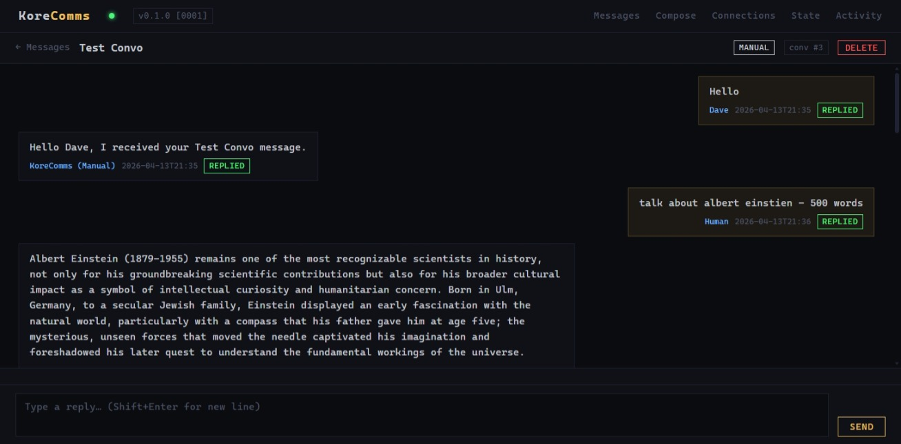

# KoreComms

> External communication hub for [MiniAgentFramework](../MiniAgentFramework) — normalises inbound messages from heterogeneous channels into a single, sequentially-processed queue and routes replies back out via the correct channel.



---

## Overview

KoreComms is one of three co-operating local services:

| Service | Role |
|---|---|
| [KoreData](../KoreData) | Data provider — web scraping, Wikipedia clone |
| [MiniAgentFramework](../MiniAgentFramework) | LLM wrapper with context and orchestration |
| **KoreComms** | External communication hub (this service) |

The agent never talks to Gmail, Outlook, or any other channel directly. KoreComms owns all that complexity. The agent polls a single clean REST API to receive the next message and post a reply.

---

## Features

- **Unified message queue** — all interface types (Gmail, Manual, future channels) feed one thread-safe FIFO queue; the agent processes messages one at a time
- **Full conversation threading** — every `/next-message` response includes the full prior thread so the agent has complete context without managing it itself
- **Chat UI** — per-conversation view with live polling, iPhone-style message alignment, and a compose bar (`Enter` to send, `Shift+Enter` for new line)
- **Gmail integration** — OAuth2 polling, reply-in-thread, de-duplication by Gmail message ID
- **Manual interface** — inject a synthetic message via the WebUI; always present, zero external dependencies
- **Adapter pattern** — adding a new channel (Outlook, SMS, Slack…) is one file and one registry entry; no core changes
- **Credentials encrypted at rest** — OAuth tokens and API secrets stored with `cryptography` (Fernet)
- **Dark amber terminal UI** — monospace, minimal, consistent with the KoreData / MiniAgentFramework aesthetic

---

## Tech Stack

- **Python 3.11+** with FastAPI + Uvicorn
- **SQLite** (WAL mode, per-call connections)
- **Jinja2** templates (server-rendered WebUI)
- **google-api-python-client** for Gmail
- **cryptography** for at-rest encryption

---

## Quick Start

```powershell
# Clone and enter the repo
cd C:\Util\GithubRepos\KoreComms

# Create a virtual environment and install dependencies
py -m venv .venv
.venv\Scripts\pip install -r requirements.txt

# Start the server
py main.py
```

The WebUI is at **http://localhost:8900**.

---

## Configuration

Edit `config/default.json` (created automatically on first run with defaults):

```json
{
  "host": "0.0.0.0",
  "port": 8900,
  "log_level": "info",
  "poll_interval": 60,
  "data_dir": "Data",
  "maf_url": "http://localhost:8901"
}
```

| Key | Default | Description |
|---|---|---|
| `host` | `0.0.0.0` | Bind address |
| `port` | `8900` | HTTP port |
| `poll_interval` | `60` | Gmail poll interval in seconds |
| `data_dir` | `Data` | SQLite database directory |
| `maf_url` | _(empty)_ | MiniAgentFramework base URL — enables agent session cleanup on conversation delete |

---

## Agent REST API

MiniAgentFramework communicates with KoreComms exclusively via REST:

| Endpoint | Method | Description |
|---|---|---|
| `/api/next-message` | GET | Dequeue the next queued message with full thread. Returns 204 if queue is empty. |
| `/api/reply` | POST | Send a reply via the originating channel. Body: `{ message_id, content }` |
| `/api/complete` | POST | Mark message as `replied` or `ignored`. Body: `{ message_id, status }` |
| `/api/send` | POST | Start a new outbound message on any interface. Body: `{ interface_id, recipient, subject, content }` |
| `/api/conversation/{id}` | GET | Return the full conversation thread as JSON (used by the live chat UI). |
| `/status` | GET | Health check — returns version and queue depth. |

---

## Message Lifecycle

```
[External Source / Human]
         │
         ▼
      QUEUED           ← arrives from an interface or chat compose bar
         │
         ▼
    PROCESSING         ← agent called GET /api/next-message; queue locked
         │
         ▼
      HANDLED
       ├── replied      ← agent called POST /api/reply then POST /api/complete
       └── ignored      ← agent called POST /api/complete (no reply)
```

Only one message is in PROCESSING at a time. The queue will not issue the next message until the current one is completed.

---

## WebUI Pages

| Path | Description |
|---|---|
| `/` | Conversation list — click any row to open the chat view |
| `/conversation/{id}` | Full chat view with live updates and compose bar |
| `/compose` | Inject a synthetic inbound message (Manual interface) |
| `/connections` | Add / edit / remove interface connections |
| `/state` | Override message state (debugging) |
| `/activity` | Agent activity log |

---

## Adding a New Interface Type

1. Create `app/interfaces/mytype.py` implementing `BaseInterface` (`poll`, `send_reply`, `send_new`)
2. Register it in `app/interfaces/registry.py`: `REGISTRY["mytype"] = MyTypeInterface`
3. Add any credential fields to the connection edit form in `connection_edit.html`

No changes to the queue, API, or database schema are required.

---

## Related Repos

- [MiniAgentFramework](../MiniAgentFramework) — the agent that consumes this queue
- [KoreData](../KoreData) — data provider used alongside the agent
